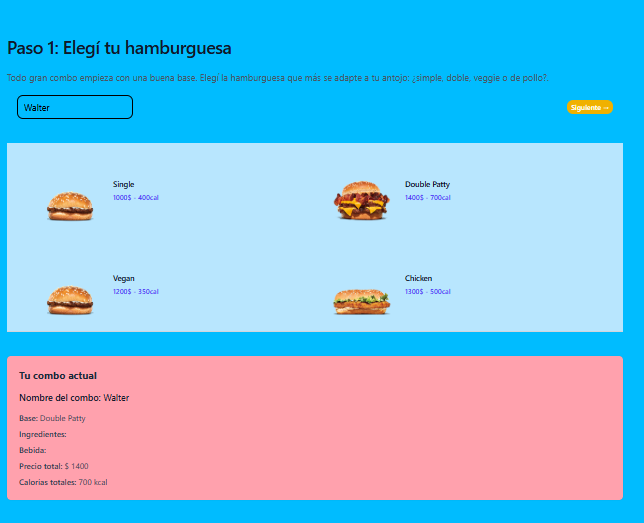
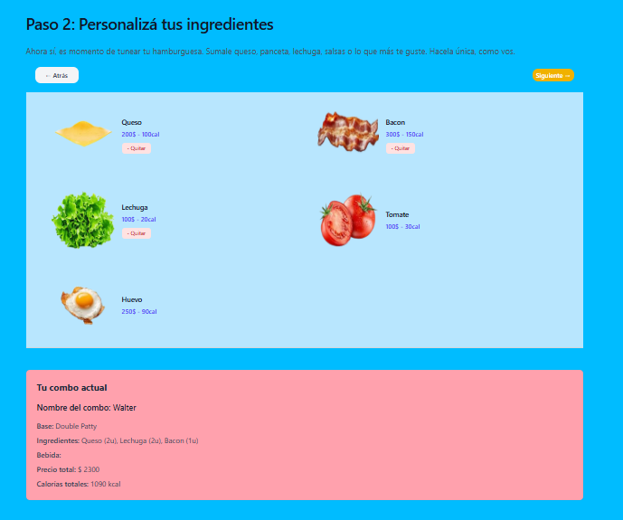
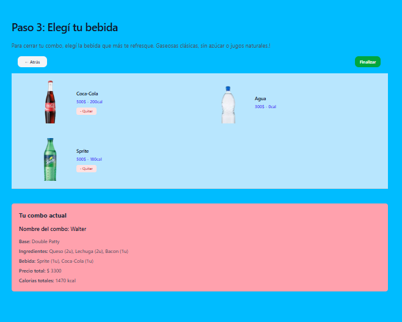
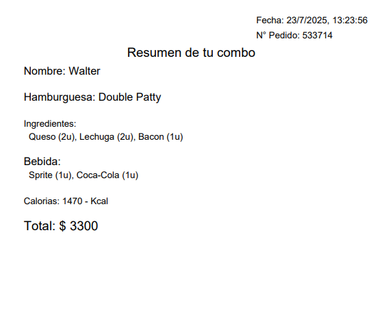

# 🍔 Proyecto: "Arma Tu Combo de Hamburguesas"

¡Bienvenido al proyecto **"Arma Tu Combo de Hamburguesas"**!

Esta aplicación permite a los usuarios **personalizar su combo de hamburguesas** eligiendo y agregando:

- 🥩 Ingredientes 
- 🍟 Acompañamientos
- 🥤 Bebidas

Todo con un **sistema de carrito de compras** integrado y una interfaz intuitiva para armar tu pedido como en una app de fast food real.

---

## 🚀 Características principales

- Selección dinámica de ingredientes
- Visualización en tiempo real del combo
- Cálculo de calorías y precio total
- Exportación del pedido a PDF
- Navegación estilo wizard (paso a paso)

---

## 🧑‍💻 Stack Tecnológico

- **Frontend:** Next.js (App Router), JavaScript, Tailwind CSS
- **Estado global:** Redux Toolkit
- **PDF Generator:** jsPDF
- **Despliegue:** Vercel

---
🚀 **Características principales**
Esta aplicación web permite a los usuarios crear combos personalizados de hamburguesas seleccionando ingredientes, acompañamientos y bebidas. Incluye un sistema de carrito de compras para revisar y modificar el pedido antes de finalizar la compra. La interfaz es intuitiva y fácil de usar, pensada para ofrecer una experiencia divertida y práctica al armar tu combo ideal.

---
📌 **Instalación**

Clona el repositorio:
git clone https://github.com/tuusuario/arma-tu-combo.git  

Instala las dependencias (si usa Node.js):
npm install  

Ejecuta el proyecto:
npm start  

---
📸 **Capturas de Pantalla**

En la siguiente imagen se muestra la pantalla inicial, donde el usuario debe seleccionar una hamburguesa y escribir su nombre para habilitar el botón "Siguiente". Sin completar ambos campos, no es posible avanzar al siguiente paso.

En esta sección, puedes ver cómo la aplicación te permite personalizar tu combo de hamburguesas de manera sencilla y visual. Cada ingrediente, acompañamiento y bebida se presenta con opciones claras para que puedas elegir según tus preferencias. Además, el sistema de carrito te muestra en tiempo real los productos seleccionados y el precio total, facilitando la revisión y modificación de tu pedido antes de finalizar la compra.

Para mejorar la experiencia de usuario, las imágenes cuentan con un efecto *hover*: al pasar el cursor sobre ellas, se resaltan con un borde y una sombra suave, permitiendo identificar fácilmente la opción seleccionada o visualizar mejor los detalles de cada pantalla.

En esta pantalla, el usuario puede seleccionar una bebida para completar su combo. Si decide no elegir ninguna, puede finalizar el pedido igualmente. Al hacer clic en "Finalizar pedido", la aplicación genera un ticket en PDF con el resumen de la compra. Además, se ofrece la opción de regresar al paso inicial para seleccionar una hamburguesa diferente y crear un nuevo combo.

En la última imagen se muestra el ticket generado por la aplicación, donde se detallan los productos seleccionados, el precio total y el total de calorías del combo. Esta pantalla permite al usuario revisar el resumen de su compra antes de finalizar el pedido.

---
🔗 **Demo**
🔜 https://app-armatu-combo.vercel.app/

  
---
🤝 **Contribuciones**
¡Las contribuciones son bienvenidas! Abre un issue o envía un pull request.

---
📜 **Licencia**
MIT License © 2025 -** Walter Castillo**